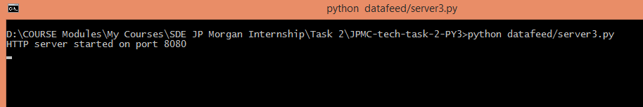
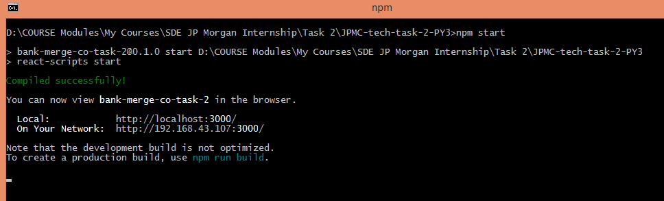
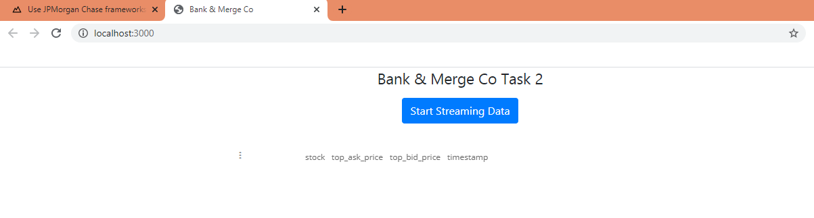
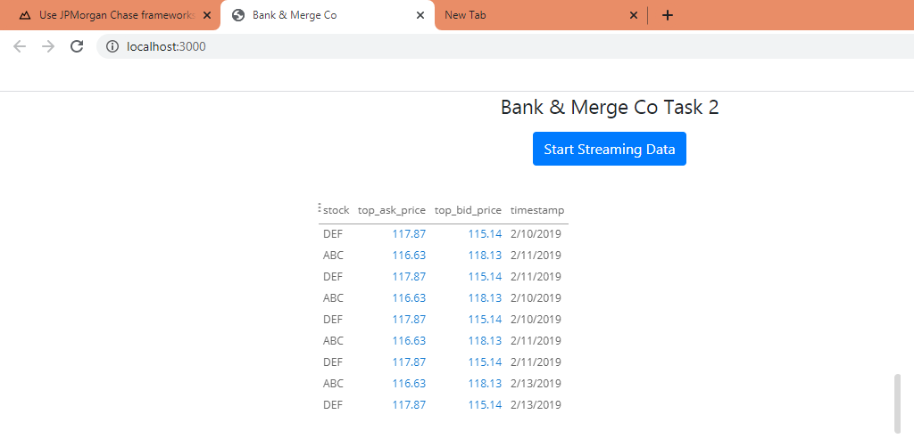
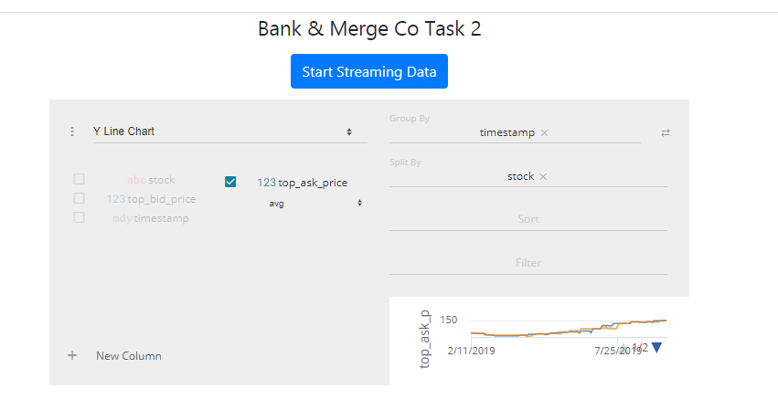
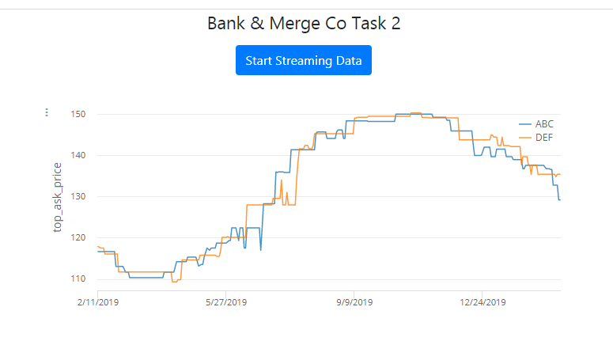

## <span style ='color : blue'>Task 2 : Use JPMorgan Chase frameworks and tools</span>

Implement the Perspective open source code in preparation for data visualization


### Step 2: Background Information

Typically, traders monitor stock prices and trading strategies by having data displayed visually on their screens in chart form. Often these charts will be accompanied by alerts that notify users when certain events occur or when preset price thresholds are hit.

JPMorgan Chase created the Perspective tool over many years to allows users to present and manipulate data feeds visually in web applications.

Perspective provides a set of flexible data transforms, such as pivots, filters, and aggregations. It utilizes bleeding-edge browser technology such as Web Assembly and Apache Arrow and is unmatched in browser performance. It is engineered for reliability and production-vetted on the JPMorgan Chase trading floor and is now available to the development community as Open Source. If you want to explore that, a link is provided in the resources section. 

------

\* Understanding the finance and trading part is not required for this task.

\* Being familiar with python scripting language, command line basics, javascript, react and typescript are not required for this task too as you will be guided in this exercise

\* (Note, you DO NOT have to install Perspective as an individual software onto your machine. All you need to complete this task is to follow the instructions in step 3)


### Step 3: Task details step by step :

**For the second module of this project will need you to accomplish the following:**

1. Set up your system by downloading the necessary files, tools and dependencies.

2. Fix the broken typescript files in repository to make the web application output correctly

3. Generate a patch file of the changes you made.

   

**We've broken down the steps for you in stages below so you can accomplish this task in an organized manner.**

**Set Up**

Before you can tackle any software or development task you need to set up your development environment. Your development environment refers to your system having all the required software installed to modify the code, as well as getting the code of the project itself onto your computer.

To do this we've created a simple PDF guide below on how to get your environment set up:

--> -> View this pdf : [setup_devenv_m2_v8.pdf](setup_devenv_m2_v8.pdf)

After setup output :

Server side `server3.py` 



Client Side CLI `npm start` :




Client Side Browser output `localhost:3000`



**Client Side Initial (After clicking `Start Streaming Data`)**



### **Making Changes**

When you’re in a work environment, you’ll usually receive tasks in the form of engineering tickets.
Here is an example of what this task looks like in the form of an engineering ticket.

Purpose:
The objective of this task will be for you to fix the client-side web application so that it displays a graph that automatically updates as it gets data from the server application (*see Before and After images below*) Currently, the web application only gets data every time you click on the 'Start Streaming Data' button and does not aggregate duplicated data.

Acceptance Criteria:

- This ticket is done when the graph displayed in the client-side web application is a continuously updating line graph whose y axis is the stock’s top_ask_price and the x-axis is the timestamp of the stock. The continuous updates to the graph should be the result of continuous requests and responses to and from the server for the stock data.
- This ticket is done when the graph is also able to aggregate duplicated data retrieved from the server

To properly make the changes necessary to complete the objectives of this task, follow the guide below.

--> -> View this pdf : [making_changes_m2_v2.pdf](making_changes_m2_v2.pdf)


To start the server navigate to the folder in command line and put : 

```powershell
C:/(folder-address)>python datafeed/server3.py
HTTP server started on port 8080
```

To run client side code i.e. mainly `App.tsx` and `Graph.tsx` : putting this into command line:

```powershell
npm install
npm start
```

This will start server on `http://localhost:3000/` or `http://192.168.43.107:3000/`


**Client Final Visualisation Setup**



**Client Final Visualisation Graph (updating real time after 110 ms)**


